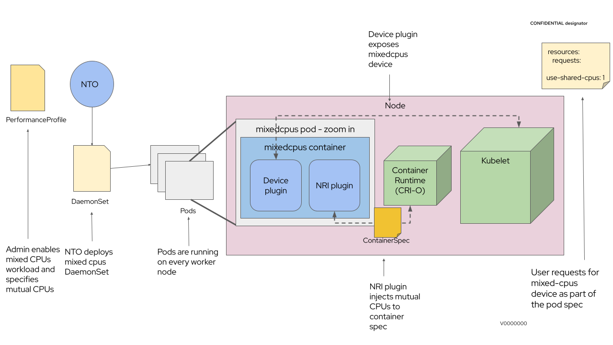

# mixed-cpu-node-plugin
Mixed-cpu-node-plugin is hybrid implementation of [NRI plugin](https://github.com/containerd/nri) and [device plugin](https://kubernetes.io/docs/concepts/extend-kubernetes/compute-storage-net/device-plugins/) that extends cpu resources management on top of Kubernetes and OpenShift platforms, by make it possible for workload containers to request for both exclusive and shared cpu resources.

It populates shared-cpus as a device which can be asked by pods that requires this kind of functionaliy.

 - POC - DONE
 - Deployment - DONE
 - UpdateContainer flow - DONE
 - Support a case when plugin deployed after app container - DONE
 - Handle reboot/restart node/kubelet/crio/pod flow - DONE
 - Unit Tests - Done
 - E2E Tests - WIP
 - Support cgroupfs - TODO 
 - Support cgroupv2 - DONE

